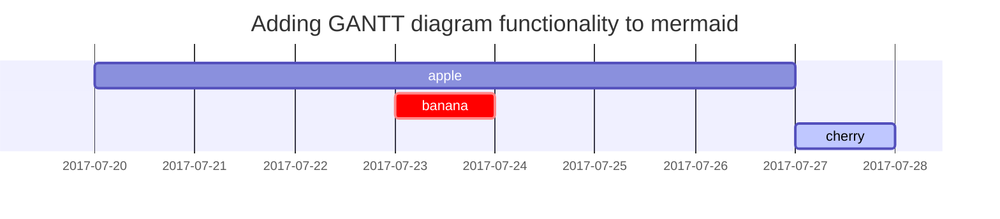

## H2 - heading
{: data-toc-skip='' .mt-4 .mb-0 }

adding image:
{: w="700" h="400" }
_Image Caption_

adding mermaid:

## Filepath

Here is the `/path/to/the/file.extend`{: .filepath}

## Links

<http://127.0.0.1:4000>
