# Create Diagrams using MermaidJs

Create diagrams in markdown using [mermaid](http://mermaid.js.org/syntax/flowchart.html) fenced code blocks:

## Flowchart
more command in https://mermaid.js.org/syntax/flowchart.html

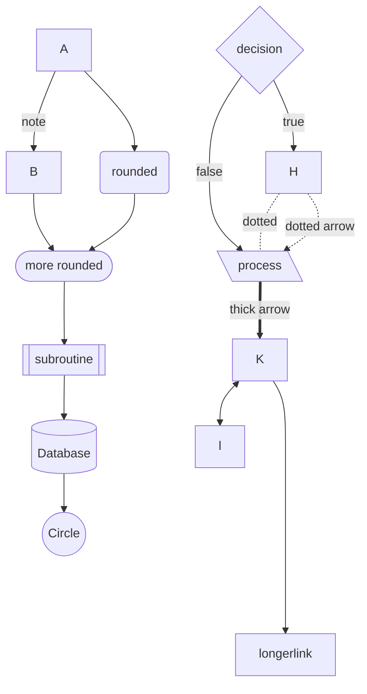
```mermaid
flowchart LR;
    A["predefined text and unicode 😋"]
    D[Another predefined node]
    A-->C;
    B-->D;
    subgraph one
    A-->B
    end
    subgraph two
    C-->D
    D-->three
    end
    subgraph three[alias]
    c1-->c2
    end
    three-->one;
    id1----id2;
    style id1 fill:#f9f,stroke:#333,stroke-width:4px
    style id2 fill:#bbf,stroke:#f66,stroke-width:2px,color:#fff,stroke-dasharray: 5 5
    A & B:::bar --> C:::foobar
    classDef foo stroke:#f00
    classDef bar stroke:#0f0
    classDef foobar stroke:#00f
```
## State Diagram
more command in https://mermaid.js.org/syntax/stateDiagram.html
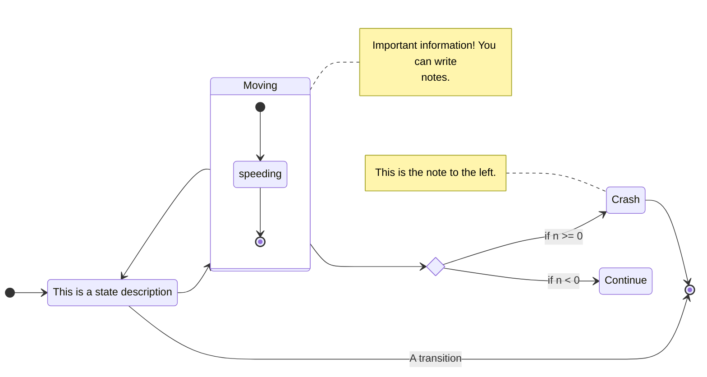
concurrent state diagram:
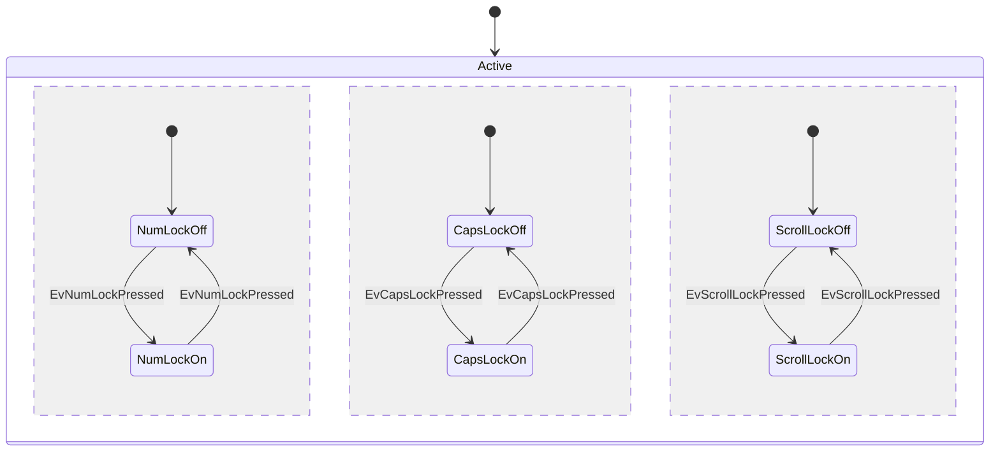
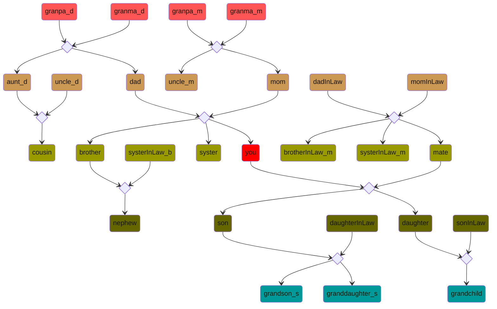
## Sequence Diagram
more command in https://mermaid.js.org/syntax/sequenceDiagram.html
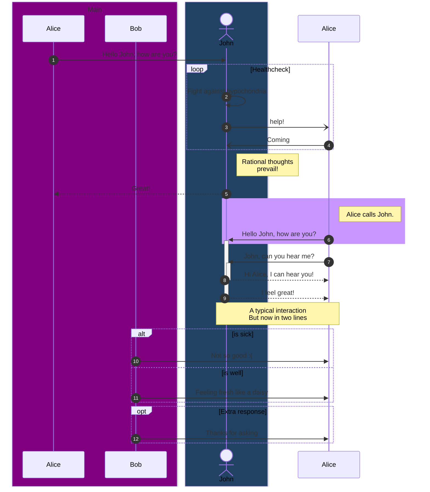
supported arrow:
| Type | Description                                      |
| ---- | ------------------------------------------------ |
| ->   | Solid line without arrow                         |
| -->  | Dotted line without arrow                        |
| ->>  | Solid line with arrowhead                        |
| -->> | Dotted line with arrowhead                       |
| -x   | Solid line with a cross at the end               |
| --x  | Dotted line with a cross at the end.             |
| -)   | Solid line with an open arrow at the end (async) |
| --)  | Dotted line with a open arrow at the end (async) |

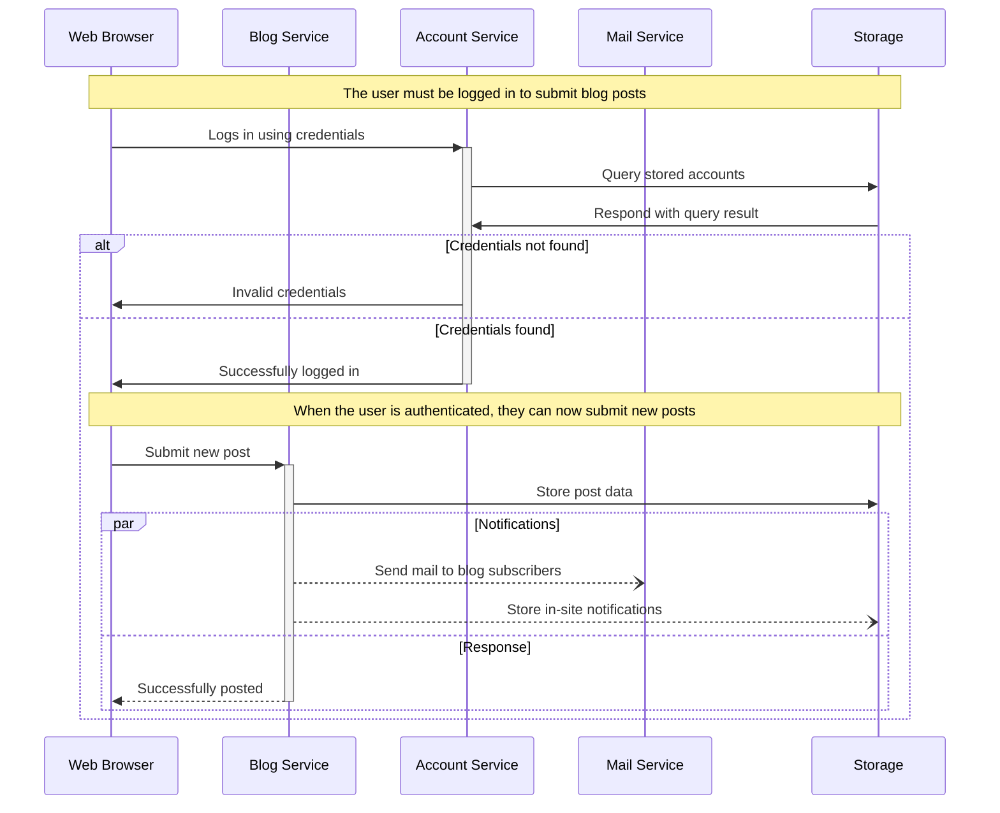

## Class Diagram
more command in https://mermaid.js.org/syntax/classDiagram.html
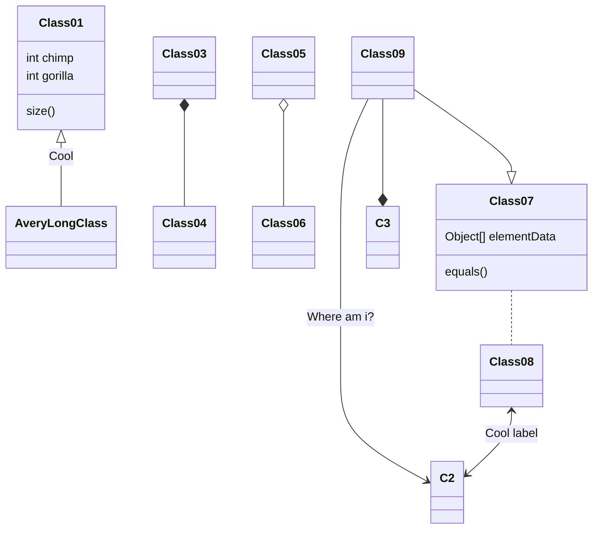

## Git Graph
more command in https://mermaid.js.org/syntax/gitgraph.html
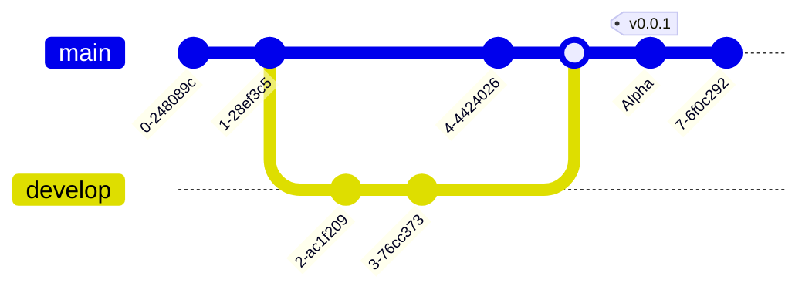
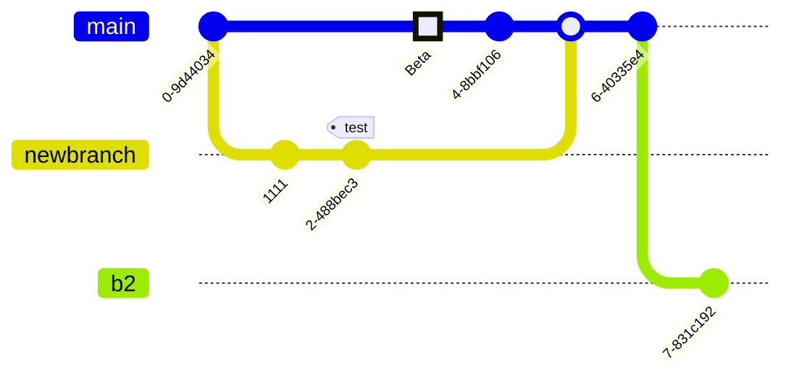

## ER Diagram
more command in https://mermaid.js.org/syntax/entityRelationshipDiagram.html
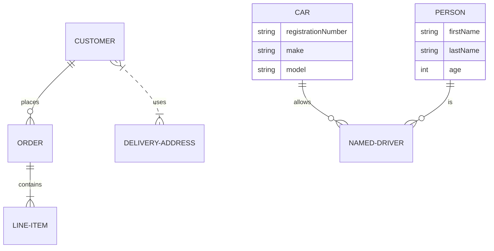
```
|   one
||  one and only one
o|  zero or one
{   many
o{  zero or many
1{  one or many

```

## Quadrant Chart
```mermaid
more command in https://mermaid.js.org/syntax/quadrantChart.html
quadrantChart
    title Reach and engagement of campaigns
    x-axis Low Reach --> High Reach
    y-axis Low Engagement --> High Engagement
    quadrant-1 We should expand
    quadrant-2 Need to promote
    quadrant-3 Re-evaluate
    quadrant-4 May be improved
    Campaign A: [0.3, 0.6]
    Campaign B: [0.45, 0.5]
    Campaign C: [0.57, 0.69]
    Campaign D: [0.78, 0.34]
    Campaign E: [0.40, 0.34]
    Campaign F: [0.35, 0.78]
```

## Pie Chart
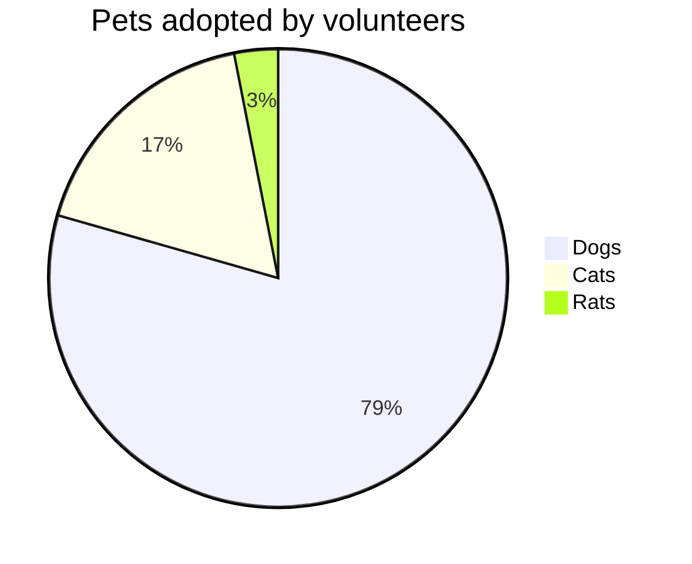
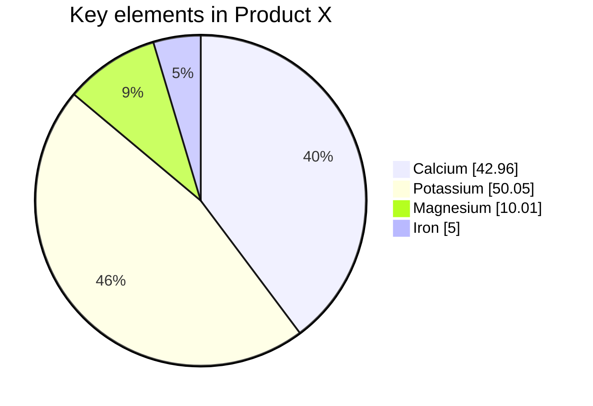

## Mind Map
more command in 
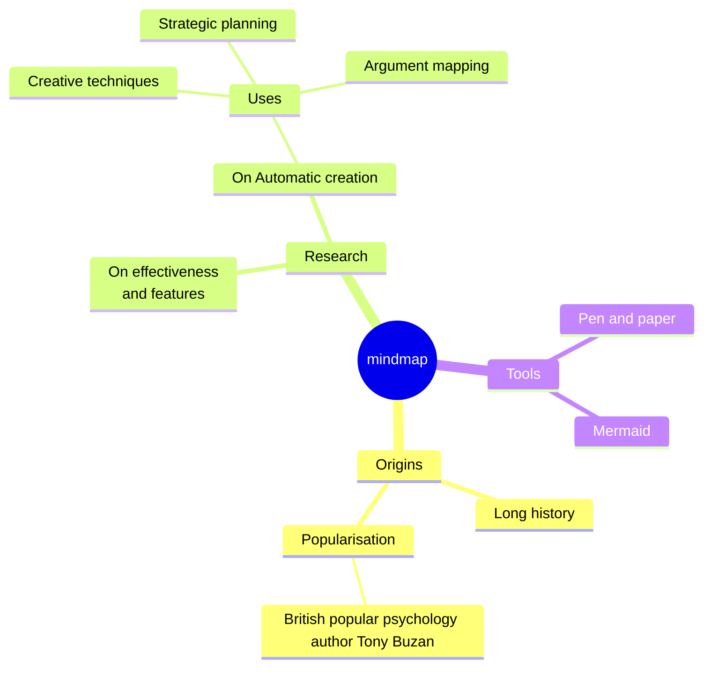