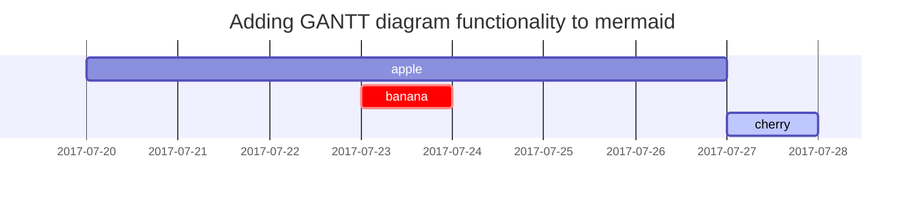

## H2 - heading
{: data-toc-skip='' .mt-4 .mb-0 }

adding image:
{: w="700" h="400" }
_Image Caption_

adding mermaid:

## Filepath

Here is the `/path/to/the/file.extend`{: .filepath}

## Links

<http://127.0.0.1:4000>

## Headings

## H1 — heading

## H2 — heading

### H3 — heading

#### H4 — heading

## Paragraph

Quisque egestas convallis ipsum, ut sollicitudin risus tincidunt a. Maecenas interdum malesuada egestas. Duis consectetur porta risus, sit amet vulputate urna facilisis ac. Phasellus semper dui non purus ultrices sodales. Aliquam ante lorem, ornare a feugiat ac, finibus nec mauris. Vivamus ut tristique nisi. Sed vel leo vulputate, efficitur risus non, posuere mi. Nullam tincidunt bibendum rutrum. Proin commodo ornare sapien. Vivamus interdum diam sed sapien blandit, sit amet aliquam risus mattis. Nullam arcu turpis, mollis quis laoreet at, placerat id nibh. Suspendisse venenatis eros eros.

## Lists

### Ordered list

1.  Firstly
2.  Secondly
3.  Thirdly

### Unordered list

-   Chapter
    -   Section
        -   Paragraph

### ToDo list

-   Job
    -   Step 1
    -   Step 2
    -   Step 3

### Description list

Sun

the star around which the earth orbits

Moon

the natural satellite of the earth, visible by reflected light from the sun

## Block Quote

> This line shows the _block quote_.

## Prompts

> An example showing the `tip` type prompt.

> An example showing the `info` type prompt.

> An example showing the `warning` type prompt.

> An example showing the `danger` type prompt.

## Tables

| Company | Contact | Country |
| --- | --- | --- |
| Alfreds Futterkiste | Maria Anders | Germany |
| Island Trading | Helen Bennett | UK |
| Magazzini Alimentari Riuniti | Giovanni Rovelli | Italy |

## Links

[http://127.0.0.1:4000](http://127.0.0.1:4000/)

Click the hook will locate the footnote<a href="https://chirpy.cotes.page/posts/text-and-typography/#fn:footnote" rel="footnote" role="doc-noteref">1</a>, and here is another footnote<a href="https://chirpy.cotes.page/posts/text-and-typography/#fn:fn-nth-2" rel="footnote" role="doc-noteref">2</a>.

## Inline code

This is an example of `Inline Code`.

## Filepath

Here is the `/path/to/the/file.extend`.

## Code blocks

### Common

`<table><tbody><tr><td><pre>1 </pre></td><td><pre>This is a common code snippet, without syntax highlight and line number. </pre></td></tr></tbody></table>`

### Specific Language

`<table><tbody><tr><td><pre>1 2 3 4 </pre></td><td><pre>if [ $? -ne 0 ]; then   echo "The command was not successful.";   #do the needful / exit fi; </pre></td></tr></tbody></table>`

### Specific filename

`<table><tbody><tr><td><pre>1 2 3 </pre></td><td><pre>@import   "colors/light-typography",   "colors/dark-typography"; </pre></td></tr></tbody></table>`

## Mathematics

The mathematics powered by [**MathJax**](https://www.mathjax.org/):

We can reference the equation as .

When , there are two solutions to and they are

## Mermaid SVG

## Images

### Default (with caption)

 _Full screen width and center alignment_

### Left aligned

### Float to left

 Praesent maximus aliquam sapien. Sed vel neque in dolor pulvinar auctor. Maecenas pharetra, sem sit amet interdum posuere, tellus lacus eleifend magna, ac lobortis felis ipsum id sapien. Proin ornare rutrum metus, ac convallis diam volutpat sit amet. Phasellus volutpat, elit sit amet tincidunt mollis, felis mi scelerisque mauris, ut facilisis leo magna accumsan sapien. In rutrum vehicula nisl eget tempor. Nullam maximus ullamcorper libero non maximus. Integer ultricies velit id convallis varius. Praesent eu nisl eu urna finibus ultrices id nec ex. Mauris ac mattis quam. Fusce aliquam est nec sapien bibendum, vitae malesuada ligula condimentum.

### Float to right

 Praesent maximus aliquam sapien. Sed vel neque in dolor pulvinar auctor. Maecenas pharetra, sem sit amet interdum posuere, tellus lacus eleifend magna, ac lobortis felis ipsum id sapien. Proin ornare rutrum metus, ac convallis diam volutpat sit amet. Phasellus volutpat, elit sit amet tincidunt mollis, felis mi scelerisque mauris, ut facilisis leo magna accumsan sapien. In rutrum vehicula nisl eget tempor. Nullam maximus ullamcorper libero non maximus. Integer ultricies velit id convallis varius. Praesent eu nisl eu urna finibus ultrices id nec ex. Mauris ac mattis quam. Fusce aliquam est nec sapien bibendum, vitae malesuada ligula condimentum.

### Dark/Light mode & Shadow

The image below will toggle dark/light mode based on theme preference, notice it has shadows.

## Video

<iframe loading="lazy" src="https://www.youtube.com/embed/Balreaj8Yqs" title="YouTube video player" frameborder="0" allow="accelerometer; autoplay; clipboard-write; encrypted-media; gyroscope; picture-in-picture" allowfullscreen=""></iframe>